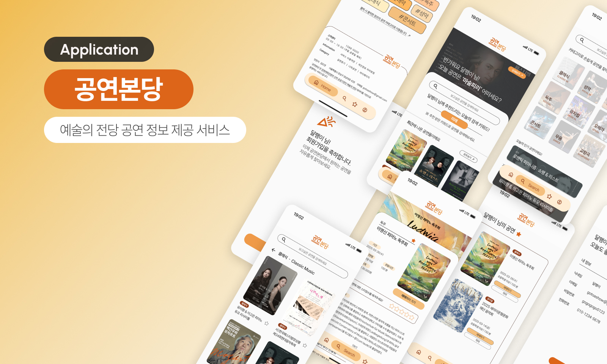

# 🎷 공연본당

> **예술의 전당을 한눈에!**  
> 예술의 전당의 다양한 공연 정보를 쉽고 빠르게 확인할 수 있는 모바일 최적화 서비스

---

## 📑 요약
### 1. **주제**
   - '공연본당' 예술의 전당 공연 정보제공 서비스
     
### 2. **목표**
   - 다양한 공연 정보의 빠른 검색과 정보 확인 가능
     
### 3. **개발 환경**
   - HTML, SCSS, Javascripts 등
     
### 4. **기간 및 인원**
   - 2025-03-31 (14일), 1인

---

## 🛠️ 사용 기술  
- **Javascripts**
- **React.js**
- **SCSS (SASS)**  
- **Github / Vercel** (배포)  
- **Kakao / Naver 로그인**  

---

## 📱 주요 기능  
- 🎲 공연 정보 랜덤 추천 (메인 배너)  
- ⭐ 나만의 공연 별점 기록  
- 💻 자체 / 카카오 / 네이버 로그인 지원  
- 📱 모바일 환경 최적화 

---

## 💼 프로젝트 폴더 구조
    📦gongyeon
     ┣ 📂front
     ┃ ┣ 📂public
     ┃ ┃ ┗ 📜data.json
     ┃ ┣ 📂src
     ┃ ┃ ┣ 📂api
     ┃ ┃ ┣ 📂components
     ┃ ┃ ┣ 📂font
     ┃ ┃ ┣ 📂hooks
     ┃ ┃ ┣ 📂images
     ┃ ┃ ┣ 📂kakao
     ┃ ┃ ┣ 📂naver
     ┃ ┃ ┣ 📂pages
     ┃ ┃ ┣ 📂routes
     ┃ ┃ ┣ 📂styles
     ┃ ┃ ┗ 📜App.js
     ┃ ┗ 🔗.env
     ┣ 📂server
     ┃ ┣ 📂api
     ┃ ┗ 📜vercel.json
     ┗ 📜README.md
     
---

## 🖥️ 배포 링크  
👉 [공연본당 바로가기](https://gongyeon-38pt.vercel.app/)

---

## 🧑‍🎤 만든 사람  
**김도연** 
- 💌 nsa10050@gmail.com  
- 💜 https://github.com/dododoodo
---

## 🌠 트러블슈팅 (Troubleshooting)
> 개발 중 이슈와 해결 방안

- ✅ 카카오 로그인 오류 - 인가코드 발급 시간 만료
- ✅ Vercel 배포 실패 - 환경변수 미설정 확인

---

## 🖼️ 미리보기 (Preview)
> 

